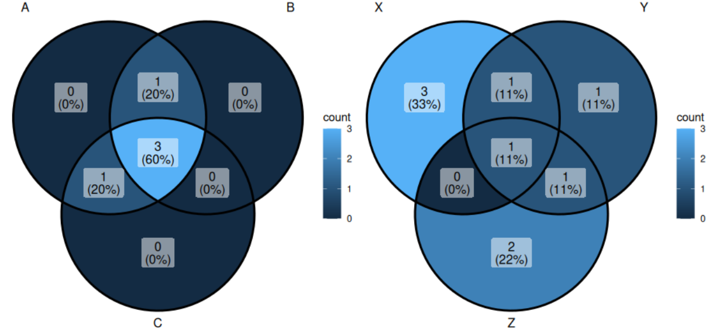
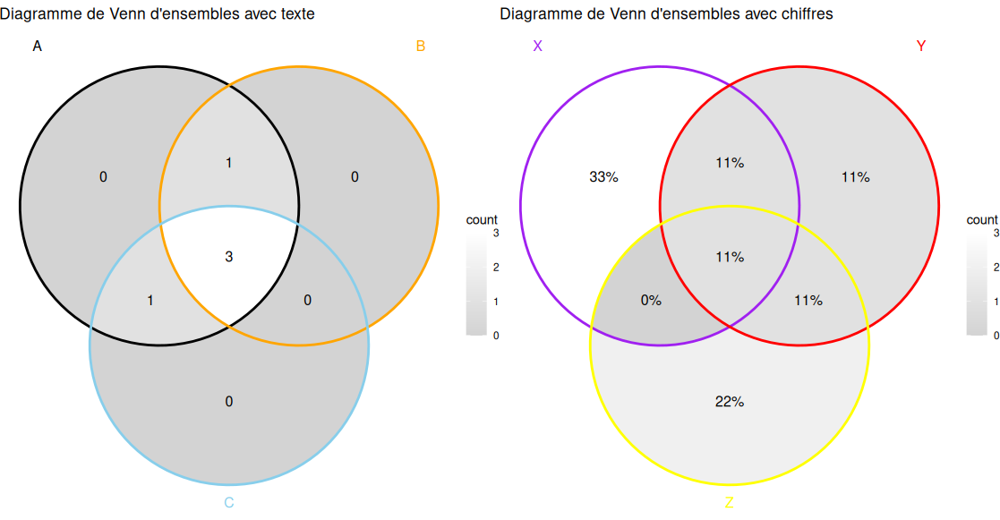

# Visualiser des relations avec les diagrammes de Venn

Il arrive de vouloir observer les relations entre deux ou plusieurs ensembles. Ainsi, souvent, un diagramme de Venn est utilisé. Celui-ci montre toutes les relations logiques possibles.

## La librairie R *ggVennDiagram*

Pour dessiner les diagrammes, nous allons nous servir de la librairie R [*ggVennDiagram*](https://cran.r-project.org/web/packages/ggVennDiagram/readme/README.html). C'est une librairie puissante qui utilise le système graphique *ggplot2*. Elle permet de produire des diagrammes esthétiques et personnalisables

## Installation

Pour l'installer et l'appeler voici les lignes de commande à exécuter:
```
install.packages("ggVennDiagram")

library(ggVennDiagram)
```

## Préparer les données 

*ggVennDiagram* fonctionne avec des listes ou des ensembles. Voici deux exemples de données :
```
sets_text <- list(
  A = c("kanar", "sheval", "lapain", "ornitoraink", "chieng"),
  B = c("sheval", "ornitoraink", "kanar", "chieng"),
  C = c("kanar", "lapain", "chieng", "sheval")
)

sets_numbers <- list(
  X = c(1, 2, 3, 4, 5),
  Y = c(4, 5, 6, 7),
  Z = c(5, 6, 8, 9)
)
```

## Création des diagrammes de Venn

### Diagramme de base

Pour créer un diagramme de Venn simple, il suffit simplement de lancer :
```
ggVennDiagram(sets_text)

ggVennDiagram(sets_numbers)

# Pour afficher les graphiques côte à côte comme ci-dessous
library(gridExtra)
grid.arrange(ggVennDiagram(sets_text), ggVennDiagram(sets_numbers), ncol=2)
```


### Personnalisation du diagramme

Il est possible de modifier deux - trois choses. Pour cela, il faut impérativement importer la librairie *ggplot2* puis entrer les lignes de commande d'intérêts : 
```
library(ggplot2)

venn_text <- ggVennDiagram(sets_text, set_color = c("black", "orange", "skyblue"), label = "count", label_alpha = 0) + 
  scale_fill_gradient(low="lightgrey", high = "white") +
  ggtitle("Diagramme de Venn d'ensembles avec texte")

venn_numbers <- ggVennDiagram(sets_numbers, set_color = c("purple", "red", "yellow"), label = "percent", label_alpha = 0) + 
  scale_fill_gradient(low="lightgrey", high = "white") +
  ggtitle("Diagramme de Venn d'ensembles avec chiffres")

grid.arrange(venn_text, venn_numbers, ncol=2)
```

Ici :

- `set_color` premet de changer la couleur des cercles
- `label = "count"` permet de n'afficher que les valeurs à l'intérieur des cercles. Il est possible de ne rien afficher avec `label = "none"`, les pourcentages uniquement avec `label = "percent"` et pourcentages et chiffres avec `label = "both"`
- `label_alpha = 0` donne la possibilité de rendre transparentes les étiquettes du texte. 0 indique une transparence totale
- `scale_fill_gradient` indique les couleurs à utiliser pour remplir les zones du diagramme. `low` pour les zones avec peu d'éléments et `high` pour les zones avec un grand nombre d'éléments
- `ggtitle` permet d'ajouter un titre au graphique



## Nombre de sets

Ce qui est intéressant avec la librairie *ggVennDiagram* c'est qu'il est possible de représenter des diagrammes de Venn jusqu'à 7 ensembles (sets) ! 


Au delà de 7 ensembles (ou moins), la librairie offre un autre type de représentation : l'upset plot. Avec une des listes utilisée précedemment : 
```
ggVennDiagram(sets_text, force_upset = TRUE, order.set.by = "name", order.intersect.by = "size")
```

Ici :

- `force_upset = TRUE,` force la génération d'un diagramme upset plot au lieu d'un diagramme de Venn classique
- `order.set.by = "name"` défini que les ensembles doivent être ordonnées par ordre alphabétique
- `order.intersect.by = "size"` pour ordonner les ensembles par taille, c'est-à-dire par le nombre d'éléments qu’ils contiennent


